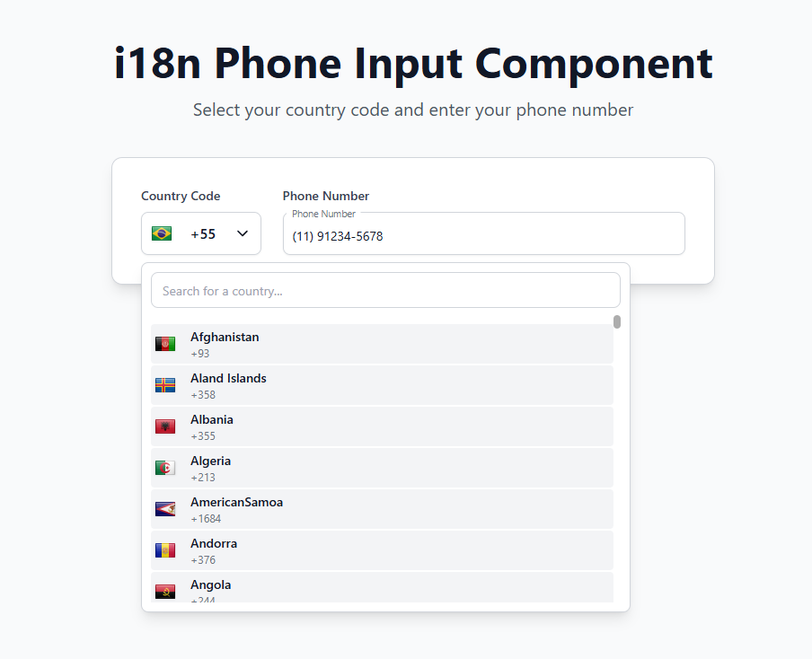

# i18n Phone Input Component

International phone input component with country code selection, flag display, and automatic validation/formatting.



## What it does

- Country code selector with 250+ countries and flags
- Real-time phone number validation using Google's libphonenumber
- Automatic formatting to national format
- Search countries by name
- Returns both E164 format (for APIs) and National format (for display)

## Tech Stack

- Vanilla JavaScript (ES6 modules)
- [google-libphonenumber](https://github.com/google/libphonenumber) - Phone validation
- [Tailwind CSS](https://tailwindcss.com/) - Styling (CDN)
- [FlagsAPI](https://flagsapi.com/) - Country flags
- Vite - Dev server

## Quick Start

```bash
npm install
npm run dev
```

Opens at `http://localhost:3000`

## Files

- `index.html` - Basic demo
- `form-example.html` - Form integration example
- `app.js` / `form-example.js` - Component logic
- `countryCodes.json` - Country data (250+ countries)

## How to Use

The component provides two phone formats:

```javascript
// After user inputs a valid number:
rawFormat       // "+5511987654321" - Use for API calls
nationalFormat  // "(11) 98765-4321" - Use for display
```

Check `form-example.html` for a complete integration example with form validation.

## Customization

Edit `countryCodes.json` to modify the country list:
```json
{
  "name": "Brazil",
  "dial_code": "+55",
  "code": "BR"
}
```

Change Tailwind classes in HTML files to customize colors and styling.

## License

MIT
